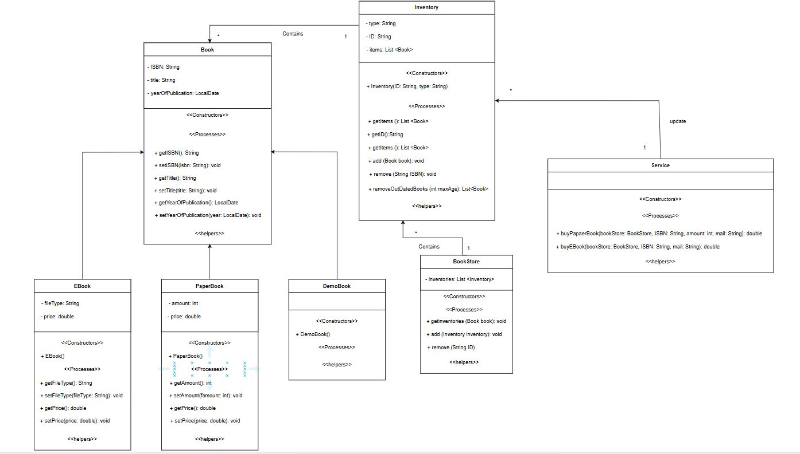
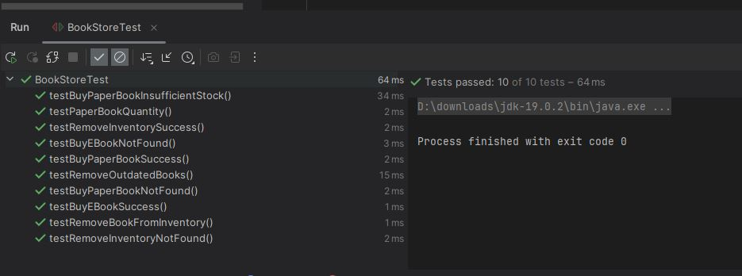

# FawaryTask-FullStack2

---

## 1. Assumptions
- **Inventory is considered unlimited unless otherwise specified.**

---

## 2. UML Diagram
**UML Class Diagram describing the system design:**

---

## 3. Test Cases for BookStore

### 3.1 Test PaperBook Quantity Merge  
Verify that duplicate PaperBooks with the same ISBN are merged properly, summing their quantities.

### 3.2 Test Successful Purchase of PaperBook  
Check that buying a PaperBook reduces stock accordingly and returns the correct paid amount.

### 3.3 Test Purchase PaperBook with Insufficient Stock  
Ensure an exception is thrown with the message `"You need more than available"` when attempting to buy more copies than available.

### 3.4 Test Purchase PaperBook Not Found  
Ensure an exception with message `"Book not found"` is thrown when buying a non-existent PaperBook.

### 3.5 Test Successful Purchase of EBook  
Verify buying an EBook returns the correct paid amount.

### 3.6 Test Purchase EBook Not Found  
Ensure an exception with message `"Book not found"` is thrown when buying a non-existent EBook.

### 3.7 Test Remove Book From Inventory  
Verify removing a book by ISBN from an Inventory reduces the inventory's item count correctly.

### 3.8 Test Remove Inventory Success  
Check that removing an entire Inventory by its ID from the BookStore reduces the inventories count accordingly.

### 3.9 Test Remove Inventory Not Found  
Ensure an exception with message `"Book not found"` is thrown when attempting to remove an Inventory with an invalid ID.

### 3.10 Test Remove Outdated Books  
Verify that removing books older than a specified age (`maxAge`) correctly removes those books and returns them.

---

## 4. Notes
- The system could be more complex with additional attributes, but the current scope avoids unnecessary complications beyond what is described.
- All tests focus strictly on the requirements and behaviors specified.

---

## 5. Additional Test Cases Overview (Visual)

